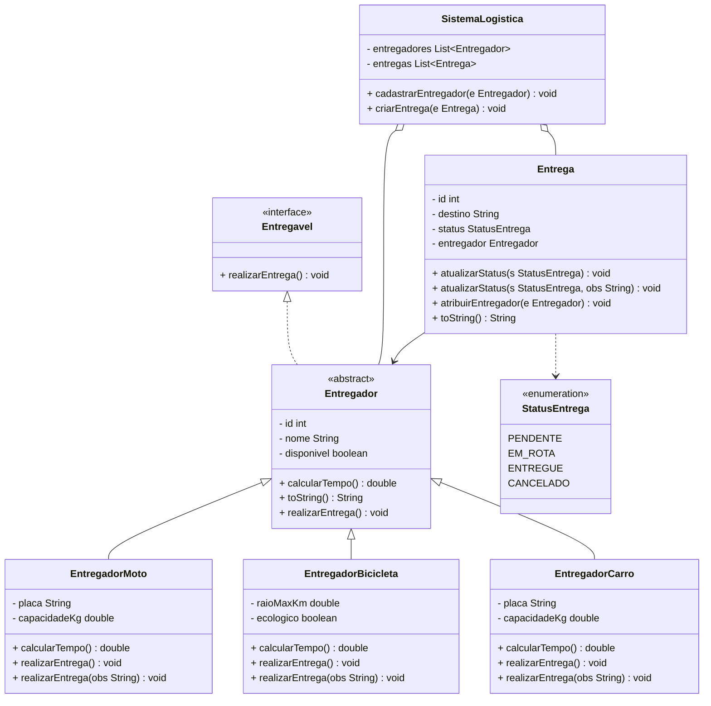

# 🚚🏍️🚴 Sistema de Logística para Entregas

Sistema orientado a objetos que simula um serviço de logística de entregas, desenvolvido em Java.
- gitflow / Conceitos de POO - **Herança**, **Abstração**, **Interface**, **Encapsulamento**, **Polimorfismo**, **Sobrecarga**

#

```
src/
├── application/
│   ├── repositories/
│   └── usecases/
├── domain/
├── infrastructure/
│   └── persistence/
└── view/
```
#
Sobre o Sistema: Simula uma operação logística de e-commerce, permitindo:
- Cadastro de entregadores (Moto, Bike, Carro)
- Criação de entregas
- Atribuição de entregadores às entregas
- Atualização de status das entregas


# Participantes:
- Artur Rodrigues Rm: 564309
- Daniel Duarte Rm: 562508
- Felippe Nascimento Rm: 562123
- Matheus Hideki Rm: 564970
- Kawan Oliveira Rm: 562197


# DIAGRAMA



## ▶️ Como Executar

1. Clone o repositório
2. Abra no IntelliJ IDEA
3. Marque a pasta `src` como **Sources Root**
4. Execute a classe `Main.java`
